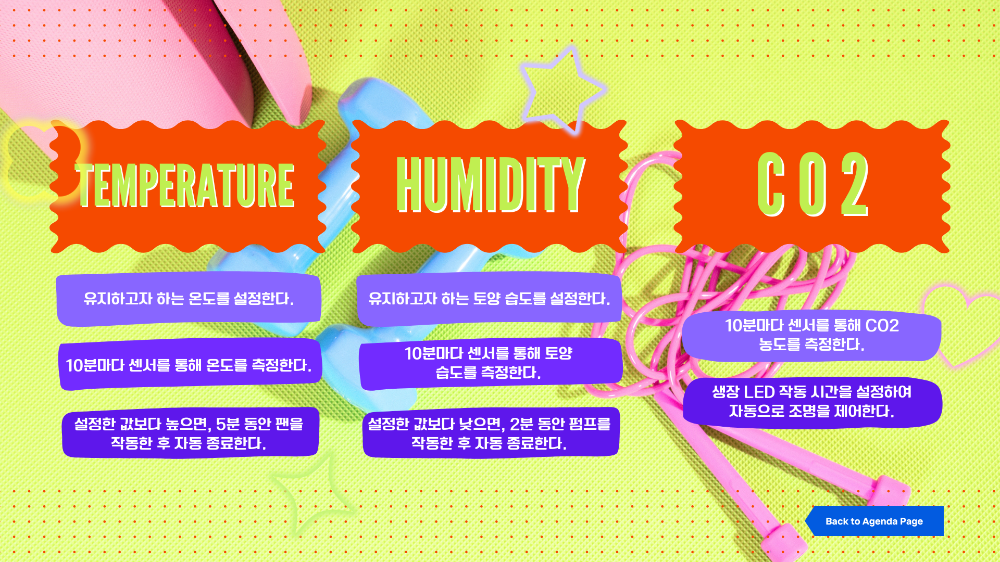
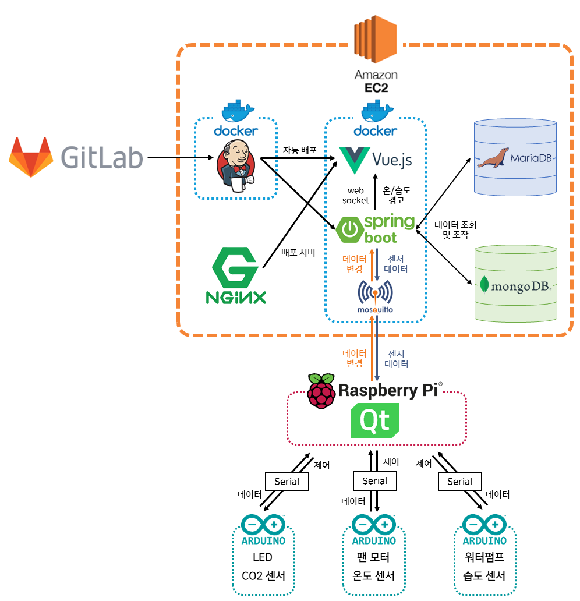
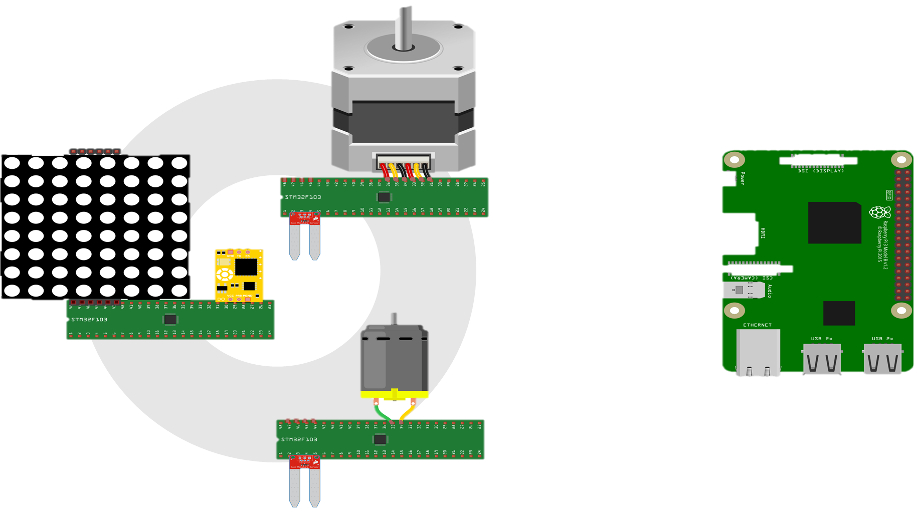

## 🥦 I CAN Farm ✋🥗🤚 
CAN통신을 활용한 스마트허브 구축을 통한 스마트팜 프로토타입 설계

## 🥦 배경

농업 인구 감소와 예상이 어려운 이상기후 현상들로 인한 기존 농업의 한계로 인해
더 효율적이고 예측할 수 있는 스마트팜의 필요성이 커지고 있습니다.
스마트팜을 타겟으로 스마트허브를 구축하고,
스마트팜에 필요한 기능들을 모듈로 제공하는 대규모 스마트팜의 프로토타입을 설계해보고자 합니다.

## 🥦 개요

저희 서비스에서는
1. 농장의 온도/습도/광합성량 조절이 가능합니다.
2. 모니터링 웹을 통해 간단하게 확인과 제어가 가능합니다.
3. 가이드라인에 따라 원하는 기능을 추가하거나 제거하는 등 커스터마이징이 가능합니다.

   

## 🥦 PERSONA

**이름:** 허정현

**나이:** 30 대

**직업:** 농부 (귀농 한지 1년)

**사는 곳:** 전라도 고흥 녹동 

**작물:** 배추, 가지, 고추 등

**특징/ 제약:**

- 3년의 기간 동안 기대했던 농촌의 생활을 이루어내지 못한다면 다시 돌아갈 생각을 하고 있음
- 1년 동안 현실적인 농사의 어려움을 경험함
  - 일정하지 않은 수확량
  - 변동이 큰 날씨
  - 최종 결과의 원인을 파악할 수 없음
- 기대했던 농촌의 생활과 현실이 달라 자괴감이 옴

**목표:**

- 농사를 좀 더 효율적으로 하고 싶음
- 하루를 농사에 사용하기 보다 다양한 취미 활동과 부가적인 활동을 통해서 수익을 얻고 싶음
- 초보 귀농인들을 위해서 적절한 급수량, 비료 양등 농사 초보자를 위한 서적을 내고 싶음
- 좀 더 다양한 작물을 키워보고 싶음

**성격:**

- 도시보다 여유로운 삶을 위해서 귀농함
- 새로운 방법과 기술에 관심이 많고 경험하고 싶어함

  

## 🥦 주요 기능

---
사용자가 웹을 통해 각 허브의 상태를 모니터링할 수 있고, 모듈마다의 타겟값과 임계값을 설정해 간편하게 제어할 수 있습니다.
유저의 다양성을 고려하여 세부 기능들을 모듈화해 확장성을 높였습니다.

## 🥦 기능별 세부 사항

---
### 모듈별 기능
 

#### 메인 허브
- DB의 설정 데이터 변경을 인식해서 보드 제어 명령 송신
- 보드들로부터 받은 데이터를 기반으로 보드들에게 적합한 제어 명령 송신
- GUI를 통해 현재 온도/습도/광합성량 등의 data와 설정값 확인 및 변경
- 연결된 카메라로 식물의 생장과정 기록 및 CCTV기능

#### 온도조절
- 실내온도를 센싱
- 설정값과 제어명령에 따라 선풍기 가동

#### 습도조절
- 토양 습도를 센싱
- 설정값과 제어명령에 따라 급수장치 가동

#### 광합성량 조절
- 이산화탄소량을 센싱
- 설정값과 제어명령에 따라 LED 가동

#### 메인페이지
- 팜 모니터링
- 기기별 로그 확인
- MM으로 기기 이상 시, 알림

#### 관리자페이지
- 데이터의 설정값과 임계값 변경

  

## 🥦 I CAN FARM 상세페이지
---

#### 🌽 Login

#### 🌽 Apply

#### 🌽 Main

## 🥦 주요 기술

---
#### 🌽 System Architecture

#### 🌽 HW System Architecture

## 🥦 협업 툴

---

- Git
- Notion
- JIRA
- MatterMost
- Webex

  

## 🥦 협업 환경

---

- Gitlab
  - 코드 버전 관리
  - Jira와 연동하여 일정 관리
  - 커밋 컨벤션 준수
  
- JIRA
  - 매주 일정에 따른 업무를 할당하여 Sprint 진행
  - JIRA 컨벤션 준수
  
- 회의
  - 아침마다 스크럼 회의 진행
  - 주별로 전 파트 코드리뷰 진행
  - 그라운드 룰 준수
  
- Notion
  - 각종 문서 아카이빙과 회의록 보관
  - 기능명세서, 이해관계자, 유즈케이스 시나리오 등 문서 보관
  - 코딩 컨벤션 정리
  - 프로젝트 일정 정리
  - 그라운드 룰 명시
  
    
## 🥦 팀원 역할 분배

---
- 주해린 : 팀장, Embedded
- 김성중 : 부팀장, Embedded
- 박도윤 : Embedded
- 선민영 : Embedded
- 공한울 : Data분석, Frontend
- 윤소희 : Backend리드, Frontend

## 🌽 Feature List

[Notion 통해 기능 명세서 보기](https://www.notion.so/3-c7540173534f49f184c4a729590883f5)

## 🌽 Story Board

[Figma를 통해 스토리 보드 보기](https://www.figma.com/file/iEkN1V9dKR4NwmZLkmVCnn/6%EB%B2%A0%EB%94%94%EB%93%9C-team-library?node-id=0-1&t=YPV1c2WtfBoiGqnO-0)

